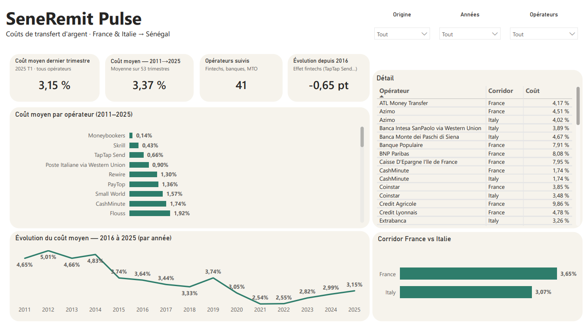
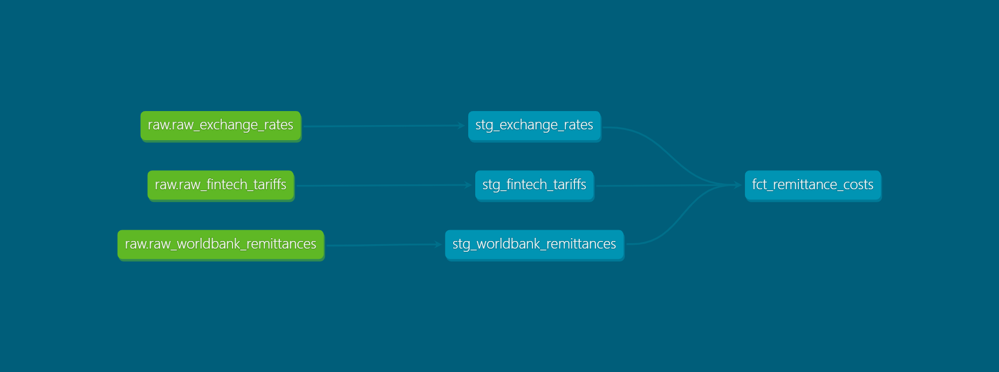

# SeneRemit-Tracker

Pipeline de données Modern Data Stack analysant le coût réel d'envoi d'argent vers le Sénégal — envois internationaux (France, Italie) et transferts locaux (Wave, Orange Money).

**Combien coûte réellement l'envoi d'argent vers le Sénégal ?** Ce projet répond à cette question avec des données réelles : 2 000+ transactions (2011–2025, source Banque Mondiale), analysées de bout en bout, de l'ingestion brute au dashboard interactif.

> 📊 [Voir le dashboard Power BI](https://app.powerbi.com/view?r=eyJrIjoiNTlkYzg3YzYtNDI3MC00NmJiLWE0NjQtMDc3MjNlMzc5ZDEzIiwidCI6ImYxYTRjMTkxLTNhNDEtNDAxOC05NzdmLTkyMWMzMGI0MzQ4NCJ9) · 📄 [Voir le post LinkedIn](#)

---

## Le résultat en un coup d'œil

Le coût moyen d'un transfert varie de **0,14 %** (Moneybookers) à **9,86 %** (Crédit Agricole) selon l'opérateur — un facteur 70 pour envoyer exactement la même somme, vers la même destination.



---

## Architecture

```
[ Excel Banque Mondiale ]  ─┐
[ CSV tarifs Wave/Orange ]  ─┼─( Python )─> [ PostgreSQL : schema raw ]
[ API taux de change ]      ─┘                        │
                                             (orchestré par Airflow)
                                                        │
                                                        ▼
                                        [ dbt : staging → marts (analytics) ]
                                                        │
                                                        ▼
                                            [ Dashboard Power BI ]
```



## Stack technique

`Python` (pandas, requests, SQLAlchemy) · `PostgreSQL` · `dbt Core` · `Apache Airflow` · `Docker & Docker Compose` · `Power BI`

## Structure du projet

```
seneremit-tracker/
├── docker-compose.yml          # PostgreSQL (meta + warehouse) + Airflow, 5 services
├── ingestion/
│   ├── ingest.py                 # ingestion des 3 sources vers PostgreSQL (schema raw)
│   └── tarifs_locaux.csv         # tarifs réels Wave / Orange Money (vérifiés manuellement)
├── dags/
│   └── seneremit_pipeline.py     # DAG Airflow : ingestion → dbt run → dbt test
└── dbt_project/
    ├── dbt_project.yml
    ├── packages.yml               # dbt_utils
    ├── macros/
    │   └── generate_schema_name.sql   # évite la concaténation de schéma par défaut de dbt
    ├── profiles_docker/
    │   └── profiles.yml.example  # à copier en profiles.yml avec vos identifiants
    └── models/
        ├── staging/                # nettoyage des 3 sources brutes, 11 tests
        └── marts/
            └── fct_remittance_costs.sql   # table de faits, 1983 lignes, % et XOF
```

## Données

| Source | Contenu | Accès |
|---|---|---|
| **Banque Mondiale — Remittance Prices Worldwide** | 2011–2025, corridors France/Italie → Sénégal, 41 opérateurs | [Téléchargement officiel](https://remittanceprices.worldbank.org/data-download) — à placer dans `ingestion/rpw_dataset_2011_2025_q1.xlsx` (non versionné, ~250k lignes) |
| **Wave / Orange Money** | Grilles tarifaires réelles, vérifiées via l'app et les CGU officielles | `ingestion/tarifs_locaux.csv` |
| **Taux de change EUR/USD → XOF** | Taux du jour | API [Frankfurter](https://frankfurter.dev) (gratuite, sans clé) |

⚠️ Les deux feuilles du fichier Banque Mondiale (avant/après T2 2016) ont des schémas de colonnes différents — `ingest.py` les harmonise avant de les charger.

## Installation

### 1. Infrastructure

```bash
docker compose up -d
```

Vérifiez `http://localhost:8080` (Airflow, identifiants `airflow`/`airflow`).

### 2. Base de données

Créez les schémas (`raw`, `staging`, `analytics`) — gérés automatiquement au premier lancement de `ingest.py`.

### 3. Ingestion (test manuel)

```bash
python -m venv venv
venv\Scripts\Activate.ps1          # Windows
pip install -r requirements.txt
python ingestion/ingest.py
```

### 4. dbt

```bash
cd dbt_project
cp profiles_docker/profiles.yml.example ~/.dbt/profiles.yml   # adapter host à "localhost" pour un usage hors Docker
dbt deps
dbt run
dbt test
dbt docs generate && dbt docs serve
```

### 5. Orchestration automatique

Activez le DAG `seneremid_dag` dans l'interface Airflow — il enchaîne `ingest.py` → `dbt run` → `dbt test`, planifié quotidiennement.

## Qualité des données

- **15 tests dbt** sur les modèles marts (`not_null`, `accepted_values`, `dbt_utils.accepted_range`)
- **11 tests** sur les modèles staging
- Documentation générée automatiquement (`dbt docs`), lineage graph complet

Certains coûts sont **négatifs** dans le jeu de données (ex : Western Union, paiement carte, été 2022) — vérifié dans les données brutes, il s'agit de promotions temporaires documentées par la méthodologie de la Banque Mondiale, pas d'une erreur de pipeline.

## Décisions techniques notables

- **`TRUNCATE` + `if_exists="append"`**, jamais `if_exists="replace"` en présence de vues dbt dépendantes — `replace` tente un `DROP TABLE`, qui échoue si une vue `staging` en dépend déjà.
- **`ENGINE.begin()`** plutôt que `connect()` + `commit()` manuel — compatible SQLAlchemy 1.4 et 2.0 (Airflow embarque une version différente de celle de l'environnement local).
- **`PG_HOST` en variable d'environnement** — le même `ingest.py` tourne sur la machine hôte (`localhost`) et dans le conteneur Airflow (`postgres_warehouse`) sans modification de code.
- **Macro `generate_schema_name` personnalisée** — évite la concaténation par défaut de dbt (`analytics_staging` au lieu de `staging`).
- **`AIRFLOW__WEBSERVER__SECRET_KEY` partagée** entre les 3 services Airflow — nécessaire pour que le webserver puisse lire les logs générés par le scheduler.

## Limites connues & prochaines étapes

- Corridors internationaux limités à France/Italie → Sénégal (portée réelle du jeu de données Banque Mondiale)
- Tarifs Wave/Orange Money non historisés — un `dbt snapshot` (SCD Type 2) permettrait de suivre leur évolution dans le temps
- Modèles incrémentaux à envisager pour l'ingestion Banque Mondiale, qui grossit chaque trimestre
- Exécution planifiée dépendante de la disponibilité locale de Docker — un déploiement cloud (VM ou Cloud Composer) garantirait une exécution 24/7

## Auteur

Idrissa Mbaye — [LinkedIn](https://www.linkedin.com/in/idrissa-mbaye) · [GitHub](https://github.com/mbayeidris)
